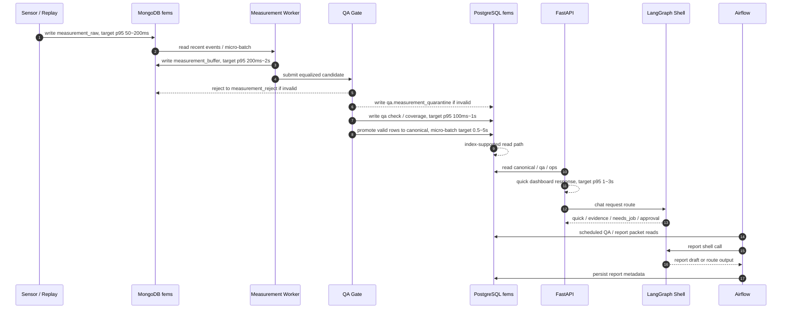

# FEMS Latency-Aware Path

```mermaid
sequenceDiagram
    autonumber

    participant S as Sensor / Replay
    participant M as MongoDB fems
    participant W as Measurement Worker
    participant Q as QA Gate
    participant P as PostgreSQL fems
    participant A as FastAPI
    participant G as LangGraph Shell
    participant F as Airflow

    S->>M: write measurement_raw, target p95 50~200ms
    M->>W: read recent events / micro-batch
    W->>M: write measurement_buffer, target p95 200ms~2s

    W->>Q: submit equalized candidate
    Q-->>M: reject to measurement_reject if invalid
    Q-->>P: write qa.measurement_quarantine if invalid
    Q->>P: write qa check / coverage, target p95 100ms~1s

    Q->>P: promote valid rows to canonical, micro-batch target 0.5~5s
    P-->>P: index-supported read path

    A->>P: read canonical / qa / ops
    A-->>A: quick dashboard response, target p95 1~3s

    A->>G: chat request route
    G-->>A: quick / evidence / needs_job / approval

    F->>P: scheduled QA / report packet reads
    F->>G: report shell call
    G-->>F: report draft or route output
    F->>P: persist report metadata
```
