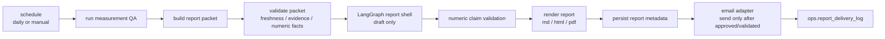

# FEMS Airflow Report Skeleton

```mermaid
flowchart LR
    START["schedule<br/>daily or manual"] --> QA["run measurement QA"]
    QA --> PACKET["build report packet"]
    PACKET --> VALIDATE["validate packet<br/>freshness / evidence / numeric facts"]
    VALIDATE --> LG["LangGraph report shell<br/>draft only"]
    LG --> CHECK["numeric claim validation"]
    CHECK --> RENDER["render report<br/>md / html / pdf"]
    RENDER --> LOG["persist report metadata"]
    LOG --> EMAIL["email adapter<br/>send only after approved/validated"]
    EMAIL --> DELIVERY["ops.report_delivery_log"]
```
